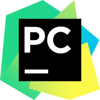

<h1 style="border-bottom: none;">Hi there 👋 I'm Alexey Malyshev - QA Engineer with 4+ years of experience</h1>

<h2 style="border-bottom: none;">My contacts:</h2>

  

 
<h2 style="border-bottom: none;" align="center">Github stats:</h2>

 

 
 

  <h2 style="border-bottom: none;" align="center">Technical Skills:</h2>
  <code></code>
  <code></code>
  <code></code>
  <code></code>
  <code></code>
  <code></code>
  <code></code>
  <code></code>
  <code></code>
  <code></code>
  <code></code>
  <code></code>
  <code></code>
  <code></code>
  <code></code>
  <code></code>

